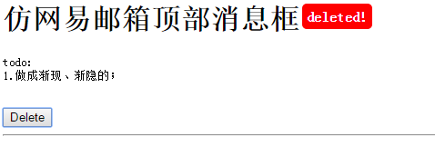
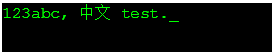

# `{name:'javascript百年讲堂'}`

目标：本项目计划推出一个案例驱动的javascript系列教程。

version log: changeLog.txt


## 特点

* (1)根据案例逐一引出知识点。
* (2)贯穿从0基础，到熟手、高手的整个过程。
* (3)本项目仅是一个指引，没有强制力，主要还是靠自觉和自学。
* (4)欢迎新老朋友加入。希望新朋友好好学习，也希望老朋友多多贡献力量。
* (5)本项目主要在github上推出，同时提供如下平台咨询。


## 加入

* JavaScript/php熟手QQ交流群 369578518  [对闲聊、广告、大图刷屏零容忍！！入群请遵守]
* github： https://github.com/DawnEve/jsLecture
* web：jsLecture.biomooc.com
* 贴吧(基本废弃)：http://tieba.baidu.com/p/4211931264


## 指导原则

- 入门看视频，提高看书籍，飘升做项目。
- 老练研开源，高手读外文，大牛讲低调~


## 详细内容


> /index.html 案例详细目录


# 1. 学习js基础功能

一个完整的JavaScript的实现，需要由三部分组成：ECMAScript(核心), DOM(文档对象模型), BOM(浏览器对象模型)。


## (1) ECMAScript(核心)

任何一个编程语言都有的功能，就是语言核心。

- 运算符
- 变量
- 控制结构: if, for, while, break, continue
- 函数: 自定义函数、递归
- 字符串
	* 正则表达式
- 数组
- 对象
	* JSON
- 类: Prototype
- 错误处理: try catch,


## (2) DOM(文档对象模型)

操作对象是 html 文档特有的属性和方法。

- Node 类型
	* 节点获取
	* 节点关系
	* 节点操作: 添加、删除、复制
- Document 类型
	* .title
	* .url
	* 查找元素：getElementById(),getElementsByTagName(),getElementsByClassName().
	* 文档写入：write(),writeln(),open(),close()
	* document.cookie
- Element类型
	* getAttribute(),获取特性 对于class，则使用“class”,而不是className，在使用element.className时可以获取class特性。
	* setAttribute()，设置特性，若特性存在，则替换。否则，创建。
	* removeAttribute()，彻底删除元素特性。
	* createElement()，创建新元素。
	* 获取和设置 css 属性、class属性
- Text 类型
	* createTextNode()，创建文本节点，如果连个文本节点是相邻同胞节点，则这个两个文本会连接起来，没有空格。


## (3) BOM(浏览器对象模型)

操作对象是浏览器特有的对象和方法。


- 窗口 window 对象
	* 窗口载入 window.onload
	* 窗口的位置 .moveTo(), .moveBy()，这2个方法不适用于框架
	* 获取窗口大小 innerWidth/Height(视图区：减去边框的宽度); outerWidth/Height(返回浏览器窗口的大小)
	* 改变窗口大小 resizeTo(), resizeBy(), 这2个方法不适用于框架
	* 打开新窗口 window.open(url, ...)
	* 定时器: setTimeout(jsFun, 毫秒时间)/clearTimeout(id); setInterval()/clearTimeout(id);
	* 系统对话框: alert(), confirm(), prompt()
- 地址 location 对象
	* location 的分解
- navigator对象：用于识别浏览器的事实标准，其属性和方法主要用于检测浏览器的类型。
- history对象(保存历史纪录)
- screen对象(表明客户端能力)


## (4) ajax/ 无刷新与后台通信

* 001/ XMLHttpRequest


## (5) canvas_SVG/ 可视化方案

* canvas

* SVG


## (6) ECMAScript 新语法


# 2. lib/ 常见操作 函数/库 归类汇总

origin: /lib/js/

test: /lib/JStest/


# 3. 知名类库学习

## (1) Vue3/

- Vue2 repo: https://github.com/miostudio/vue_learn


## (2) jQuery/


## (3) 自己的类库 dawnJS

按照模块归类的js脚本。

后期准备做模块化，研究js常用模式。

详情见 https://github.com/dawneve/dawnJS


# 4. example/ 对常见组件进行重写、优化、封装

常见组件：焦点图、tab图、下拉菜单、提示框、

## (1) MarkDown 解析器 //todo

[MarkDown语法](http://sspai.com/25137)

  


```JavaScript
$('div_id').innerHTML="456";

var a=123;
```


## (2) 经典案例

### 描述：仿网易邮箱顶部**消息框**  

- example/s001_popUpMsg_toast.html  

需求：  

1. 写一个类似163邮箱顶部出现一会就消失的提示框; 
2. 便于使用;
3. 多个对象调用消息框`互不影响`，且不占用过多资源;
4. 更美观的`渐隐`、`渐显`、`向上收缩`等效果;

效果图：

  


### 描述：JS字幕**打字效果**  

- example/s002-JsPrinter.html
- example/s002-JsPrinterOOP.html

需求：  

1. 结合css和js实现打字效果;  
2. 最好使用OOP实现；

效果图:

 

js prototype

 


### 描述：js可拖动竖直滚动条

- example/s003-scrollBar.html

需求：

1. 可拖动事件


### 描述： 角落的菜单，可伸缩，伸缩三种效果

- example/s004-cornerMenu.html
- example/s004-cornerMenu_OOP.html

需求：

1. 完美运动框架 startMove.js 和其OOP版本 startMove_OOP.js 
2. 可以实现物体的运动：px像素的改变、透明度的变化。
3. 详细过程看 example/startMove/ 文件夹中的html。


### 描述： 响应键盘上下左右键

- example/s005-keyboardEvent.html

需求： 

1. 鼠标实现小说翻页、图片切换；


### 描述： 鼠标自由拖动的盒子，有拖动区和非拖动区

- example/s006-dragBox.html

需求： 

1. 认识浏览器内各种width的差异；
2. 详细看 example/move_drag/ 文件夹中的html。


### 描述： 焦点图/轮播图

- example/s008-carousel/

需求： 

1. 任务列表大屏；轮播图效果，鼠标悬停暂停，支持单击切换，键盘左右箭头切换
2. 详细看 example/s008-carousel/ 文件夹中的 index3.html


# 资源 [排名不分先后顺序]

1. 简单易懂的JQuery http://www.nowamagic.net/librarys/books/contents/jquery
2. 阮一峰的博客 http://www.ruanyifeng.com/
3. 廖雪峰的博客 http://www.liaoxuefeng.com/
4. DOM 和 BOM 操作: https://blog.csdn.net/QWH_PYTHON/article/details/102758025
